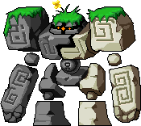

# A guide to vicloc

- [What is &ldquo;vicloc&rdquo;?](#what-is-ldquo-vicloc-rdquo)
    - [Why vicloc?](#why-vicloc)
- [General guidelines for viclocking](#general-guidelines-for-viclocking)
- [A comparison of vicloc classes/jobs](#a-comparison-of-vicloc-classes-jobs)
    - [&#x1f530; Beginners](#x1f530-beginners)
    - [&#x2694;&#xfe0f; Warriors](#x2694-xfe0f-warriors)
        - [Fighter](#fighter)
        - [Page](#page)
        - [Spear(wo)man](#spear-wo-man)
    - [&#x1f9d9; Mages](#x1f9d9-mages)
        - [Fire/poison magician](#fire-poison-magician)
        - [Ice/lightning magician](#ice-lightning-magician)
        - [Cleric](#cleric)
    - [&#x1f3f9; Archers](#x1f3f9-archers)
        - [Hunter](#hunter)
        - [Crossbow(o)man](#crossbow-o-man)
    - [&#x1f977; Thieves](#x1f977-thieves)
        - [Assassin](#assassin)
        - [Bandit](#bandit)
    - [&#x1f3f4;&#x200d;&#x2620;&#xfe0f; Pirates](#x1f3f4-x200d-x2620-xfe0f-pirates)
        - [Brawler](#brawler)
        - [Gunslinger](#gunslinger)
- [Levelling up](#levelling-up)
    - [Training areas](#training-areas)
    - [Party quests](#party-quests)
- [Items](#items)
    - [Equipment](#equipment)
    - [Scrolling](#scrolling)
    - [Potions/food](#potions-food)
    - [Other items](#other-items)
    - [Making money](#making-money)
    - [Monster Book Ring](#monster-book-ring)
- [Notable quests](#notable-quests)
- [Marriage](#marriage)
- [Endgame](#endgame)

## What is &ldquo;vicloc&rdquo;?

[\[&uarr; Go back to top &uarr;\]](#a-guide-to-vicloc)

&ldquo;Vicloc&rdquo; (a\.k\.a. &ldquo;viclock&rdquo;) stands for
&ldquo;Victoria-Island-locked&rdquo;. Characters playing in this style of
MapleStory (who may be called &ldquo;viclockers&rdquo; or &ldquo;Victoria
Islanders&rdquo;) leave Maple Island\[1\], but upon doing so, never
leave Victoria Island (a\.k\.a. &ldquo;Vic Island&rdquo; or simply
&ldquo;Vic&rdquo;). We define Victoria Island as the [union] of the following
regions of the Maple World:

- The main continent:
    - [Lith Harbor](https://maplelegends.com/lib/map?id=104000000)
    - [Perion](https://maplelegends.com/lib/map?id=102000000)
    - [Ellinia](https://maplelegends.com/lib/map?id=101000000)
    - [Henesys](https://maplelegends.com/lib/map?id=100000000)
    - [Kerning City](https://maplelegends.com/lib/map?id=103000000)
    - [Nautilus Harbor](https://maplelegends.com/lib/map?id=120000000)
    - [Sleepywood](https://maplelegends.com/lib/map?id=105040300)
- [Amoria](https://maplelegends.com/lib/map?id=680000000)
- [Florina Beach](https://maplelegends.com/lib/map?id=110000000)
- [The Free Market](https://maplelegends.com/lib/map?id=910000000)

Like Maple Islanders (a\.k\.a. &ldquo;islanders&rdquo;), Victoria Islanders are
largely isolated from &ldquo;outlanders&rdquo; (non-vicloc characters), albeit
to a lesser degree. They cannot trade with, nor receive items/mesos from,
outlanders. They also cannot use [gachapon
machines](https://maplelegends.com/lib/npc?id=9100100), nor certain Cash Shop
items like e\.g. [Myo Myo](https://maplelegends.com/lib/cash?id=5450000). For a
full list of the rules of vicloc, please see [rules\.md](./rules.md).

Because they can never leave Vic Island, viclockers can never advance beyond
second job. This reflects an earlier version of MapleStory, wherein the
Training Camp, Maple Island, and Victoria Island collectively made up the known
Maple World. However, vicloc can be played even in advanced versions of the
game, which may have other continents (e\.g. Ossyria), pirates, fourth job,
etc. For this reason, we consider new canonical additions to Victoria Island
&mdash; e\.g. Nautilus Harbor and Amoria &mdash; to be part of Victoria Island
for the purpose of vicloc.

Footnotes for &ldquo;What is &lsquo;vicloc&rsquo;?&rdquo;

\[1\]: For technical reasons, we consider campers (who never leave the Training
Camp) and Maple Islanders (who never leave Maple Island) to be [special
cases][degeneracy] of vicloc characters; however, this is _not usually_ what we
mean by &ldquo;vicloc&rdquo;.

[union]: https://en.wikipedia.org/wiki/Union_(set_theory)
[degeneracy]: https://en.wikipedia.org/wiki/Degeneracy_(mathematics)

### Why vicloc?

[\[&uarr; Go back to top &uarr;\]](#a-guide-to-vicloc)

Ultimately, the simple answer to this question is: because it&rsquo;s fun. But
it&rsquo;s worth exploring a little bit about what makes vicloc so special.

When compared to usual MapleStory play in most servers, vicloc settling for
less &mdash; viz. no third job, no fourth job, and generally lower-level
characters &mdash; is actually a huge asset. In gameplay styles with these
higher-powered characters, the higher jobs and higher levels are wildly
different from the earlier parts of the game, and the rest of the game gets
warped around them. Thus, the average player&rsquo;s goal is merely to get to
&ldquo;the endgame&rdquo; as quickly as possible, ultimately forgetting what
makes MapleStory so good to begin with! Along with this comes undesirable modes
of gameplay (or lack of gameplay) like washing, leeching, etc., as well as
serious [balance](https://en.wikipedia.org/wiki/Game_balance) issues due to the
inflated power of almost all truly useful skills in the game.

With vicloc, there is only MapleStory. Victoria Island is a lot bigger than you
think, if you care to explore it. And you&rsquo;ll find that vicloc suffers
from fewer issues of game balance, giving you more time to explore the world
and do fun stuff with your friends, without having to worry about that stuff.

When compared to Maple Islanding (&ldquo;islanding&rdquo; in the usual sense),
vicloc is obviously less restrictive, has more content to explore, and more
jobs &amp; character builds to try out. Vicloc is a [strict
superset](https://en.wikipedia.org/wiki/Subset) of Maple Islanding, adding just
enough to the game to make it richer, without running into the issues discussed
above. Depending on the server/implementation that you&rsquo;re playing on,
viclockers may have access to off-Maple-Island content such as&hellip;:

- Classes such as:
    - Warriors (sword(wo)men, fighters, pages, spear(wo)men).
    - Mages (magicians, fire/poison magicians, ice/lightning magicians,
      clerics).
    - Archers (archers, hunters, crossbow(o)men).
    - Thieves (rogues, assassins, bandits).
    - Pirates (pirates, brawlers, gunslingers).
- [Henesys Party Quest](https://maplelegends.com/lib/map?id=910010000) (HPQ).
- [Kerning Party Quest](https://maplelegends.com/lib/map?id=103000800) (KPQ).
- [Amoria Party Quest](https://maplelegends.com/lib/map?id=670010100) (APQ).
- [Sharenian Party Quest](https://maplelegends.com/lib/map?id=990000000) (SPQ;
  a\.k\.a. Guild Party Quest, GPQ).
- Many quests &amp; questlines!
- Area bosses such as:
    - [Mano](https://maplelegends.com/lib/monster?id=2220000).
    - [Stumpy](https://maplelegends.com/lib/monster?id=3220000).
    - [Faust](https://maplelegends.com/lib/monster?id=5220002).
    - [Mushmom](https://maplelegends.com/lib/monster?id=6130101).
    - [King Clang](https://maplelegends.com/lib/monster?id=5220000).
    - [Zombie Mushmom](https://maplelegends.com/lib/monster?id=6300005).
    - [Dyle](https://maplelegends.com/lib/monster?id=6220000).
    - [Jr. Balrog](https://maplelegends.com/lib/monster?id=8130100).
- Countless equipment items to use &amp; to upgrade.
- Jump quests.
- The whole island of Victoria to explore, with all of its flora &amp; fauna!

## General guidelines for viclocking

[\[&uarr; Go back to top &uarr;\]](#a-guide-to-vicloc)

- Victoria Island is your domain. It&rsquo;s your duty to explore it in all of
  its niches and obscurities: do the quests that you can find, kill the
  monsters that you can find, and carve your own path.
- There is always difficulty at the beginning. Vicloc is pretty brutal when
  first starting out, and you&rsquo;ll be aching for potion money. However,
  with some shrewdness and determination, anyone can overcome this financial
  despair!
- Defences (WDEF and MDEF) actually matter in vicloc. Yes, you heard that
  right.
- Events are your best friend. Events allow viclockers access to activities,
  locations, and items that they wouldn&rsquo;t otherwise have access to.
- Area bosses ([Faust](https://maplelegends.com/lib/monster?id=5220002), [King
  Clang](https://maplelegends.com/lib/monster?id=5220000), [Jr.
  Balrog](https://maplelegends.com/lib/monster?id=8130100), etc.) are the
  source of many wonderful things in vicloc, so keep an eye on them!
- \[&hellip;TODO&hellip;\]
- Have fun!!

## A comparison of vicloc classes/jobs

[\[&uarr; Go back to top &uarr;\]](#a-guide-to-vicloc)

As mentioned above, [game balance](https://en.wikipedia.org/wiki/Game_balance)
pans out differently in vicloc than it does in other modes of gameplay, despite
there being essentially the same character archetypes. This is, in part, due to
the lack of third and fourth jobs in vicloc &mdash; second job is the highest
job advancement for viclockers. That being said, these differences in game
balance generally turn out for the better: for the most part, every class in
vicloc has its place, and no class is gratuitously &ldquo;more powerful&rdquo;
than any other.

With this in mind, let&rsquo;s take a look at each class individually, and
consider how it compares to the others.

### &#x1f530; Beginners

[\[&uarr; Go back to top &uarr;\]](#a-guide-to-vicloc)

As you&rsquo;d expect,
[permabeginners](https://oddjobs.codeberg.page/guides/introduction-to-odd-jobs/#permabeginner-outland)
play similarly to how they do outside of vicloc; naturally, they don&rsquo;t
care that third and fourth job don&rsquo;t exist. On the other hand, this
isn&rsquo;t _quite_ true: the overall lower-powered nature of vicloc characters
in general allows a dedicated permabeginner who hones their craft to remain
more relevant than they would in other modes of gameplay.

### &#x2694;&#xfe0f; Warriors

[\[&uarr; Go back to top &uarr;\]](#a-guide-to-vicloc)

From a bird&rsquo;s-eye view, most warriors (with the exception of some odd
ones) tend to play very similarly: their bread-and-butter is the use of [Power
Strike](https://maplelegends.com/lib/skill?id=1001004) and [Slash
Blast](https://maplelegends.com/lib/skill?id=1001005) in conjunction with melee
weapons. In addition, warriors make for very strong support: each of the three
warrior second-job classes has its own party support skill (or two such skills,
in the case of spear(wo)man). And, last but not least, warriors are also
characterised by their extremely high natural durability.

Their ability to easily survive and support the party, combined with their
ability to effectively deal multi-target and single-target DPS from first job
onwards, makes warriors extremely powerful at all levels of the game.

#### Fighter

[\[&uarr; Go back to top &uarr;\]](#a-guide-to-vicloc)

**Elevator pitch:** &ldquo;rage pls&rdquo;

Fighters differentiate themselves from other warriors mainly in two ways:
weapon choice (swords and/or axes), and
[Rage](https://maplelegends.com/lib/skill?id=1101006). It&rsquo;s difficult to
understate just how important Rage is in vicloc; without it, physical attackers
are generally stuck with either [Warrior
Potion](https://maplelegends.com/lib/use?id=2002004)s (+5 WATK), or the much
more difficult-to-farm [Drake&rsquo;s
Blood](https://maplelegends.com/lib/use?id=2012000) (+8 WATK). This means that
virtually any party that wishes to optimise their DPS output must have at least
one fighter amongst their ranks.

Pros &amp; cons

Pros:

- Rage is by far the most powerful sustainable damage buff in the game.
- Good multi-target and single-target DPS from first job onwards, and comfort
  in melee combat.
    - Their solid multi-target DPS and comfort in melee combat makes them
      extremely good at farming crowded maps like
      [FoG](https://maplelegends.com/lib/map?id=105040306).
- Naturally very durable. Fighters are also the most resistant to physical
  attacks of any class in the game (tied with page), due to [Power
  Guard](https://maplelegends.com/lib/skill?id=1101007).
    - Also due to Power Guard, fighters make excellent [HP
      warriors](https://oddjobs.codeberg.page/guides/introduction-to-odd-jobs/#hp-warrior).

Cons:

- Naturally short reach means that they have to constantly stay adjacent to
  their foe(s).
- Poor mobility.
- Not quite as high potential for single-target or multi-target DPS, when
  compared to certain other classes.
- Accuracy issues (with the exception of some odd ones, e\.g. [DEX
  fighters](https://oddjobs.codeberg.page/guides/introduction-to-odd-jobs/#dex-warrior)).

#### Page

[\[&uarr; Go back to top &uarr;\]](#a-guide-to-vicloc)

**Elevator pitch:** All foes cower before the page&rsquo;s threatening
presence.

Pages differentiate themselves from other warriors mainly in two ways: weapon
choice (blunt weapons and/or swords), and
[Threaten](https://maplelegends.com/lib/skill?id=1201006). Like the Rage of
fighters, Threaten can be used to optimise the party&rsquo;s DPS output.
However, unlike Rage, Threaten is a debuff that lowers the foe&rsquo;s
resistance to physical attacks, _and_ their ability to deal physical damage.
This is a double-edged sword: on the one hand, this means that Threaten is only
truly useful during boss fights, and usually not so much when training/hunting;
on the other hand, this means that Threaten is especially powerful against
strong bosses like those found in
[SPQ](https://maplelegends.com/lib/map?id=990000000),
[APQ](https://maplelegends.com/lib/map?id=670010100), and [The Cursed
Sanctuary](https://maplelegends.com/lib/map?id=105090900), and has defensive
effects (i\.e. it&rsquo;s not purely offensive).

Pros &amp; cons

Pros:

- Threaten is a powerful party support skill with both offensive and defensive
  effects, very useful during boss fights.
- Good multi-target and single-target DPS from first job onwards, and comfort
  in melee combat.
    - Their solid multi-target DPS and comfort in melee combat makes them
      extremely good at farming crowded maps like
      [FoG](https://maplelegends.com/lib/map?id=105040306).
- Naturally very durable. Pages are also the most resistant to physical attacks
  of any class in the game (tied with fighter), due to [Power
  Guard](https://maplelegends.com/lib/skill?id=1201007).
    - Also due to Power Guard, pages make good [HP
      warriors](https://oddjobs.codeberg.page/guides/introduction-to-odd-jobs/#hp-warrior).

Cons:

- Naturally short reach means that they have to constantly stay adjacent to
  their foe(s).
- Poor mobility.
- Not quite as high potential for single-target or multi-target DPS, when
  compared to certain other classes.
- Accuracy issues (with the exception of some odd ones, e\.g. [DEX
  pages](https://oddjobs.codeberg.page/guides/introduction-to-odd-jobs/#dex-warrior)).
- Threaten is not always useful; its usefulness is _usually_ limited to boss
  fights.

#### Spear(wo)man

[\[&uarr; Go back to top &uarr;\]](#a-guide-to-vicloc)

**Elevator pitch:** Protect your party!

Spear(wo)men differentiate themselves from other warriors mainly in two ways:
weapon choice (polearms and/or spears), and [Hyper
Body](https://maplelegends.com/lib/skill?id=1301007)/[Iron
Will](https://maplelegends.com/lib/skill?id=1301006). Unlike fighters and
pages, the spear(wo)man has not one, but two party support skills, and both are
purely defensive. The extreme power of these two skills combined makes the
spear(wo)man the ultimate party protector, and can also help the party to save
money on potions.

Pros &amp; cons

Pros:

- Hyper Body &amp; Iron Will form the most powerful party-defence arsenal in
  the game.
- Good multi-target and single-target DPS from first job onwards, and comfort
  in melee combat.
    - Their solid multi-target DPS and comfort in melee combat makes them
      extremely good at farming crowded maps like
      [FoG](https://maplelegends.com/lib/map?id=105040306).
- Naturally extremely durable.

Cons:

- Naturally short reach means that they have to constantly stay adjacent to
  their foe(s), although the have a mild advantage over one-handed weapon users
  due to the large reach of polearms &amp; spears.
- Poor mobility.
- Not quite as high potential for single-target or multi-target DPS, when
  compared to certain other classes.
- Accuracy issues (with the exception of some odd ones, e\.g. [DEX
  spear(wo)men](https://oddjobs.codeberg.page/guides/introduction-to-odd-jobs/#dex-warrior)).
- Hyper Body &amp; Iron Will are susceptible to being dispelled in
  [SPQ](https://maplelegends.com/lib/map?id=990000000) and
  [APQ](https://maplelegends.com/lib/map?id=670010100). Furthermore, these
  skills are largely just meso-saving skills, outside of the realm of boss
  fights.

### &#x1f9d9; Mages

[\[&uarr; Go back to top &uarr;\]](#a-guide-to-vicloc)

Mages are entirely unique in their ability to deal magical damage, and in their
ability to deal elemental damage. They are also naturally mobile due to
[Teleport](https://maplelegends.com/lib/skill?id=2101002), and naturally fairly
durable with [Magic Guard](https://maplelegends.com/lib/skill?id=2001002).
However, beyond this, the three mage classes diverge considerably.

#### Fire/poison magician

[\[&uarr; Go back to top &uarr;\]](#a-guide-to-vicloc)

**Elevator pitch:** Huge single-target elemental DPS.

Fire/poison magicians sit alongside thieves as the only classes that lack
multi-target attacks entirely. This results in F/P magicians being the
[red-headed](https://en.wiktionary.org/wiki/red-headed_stepchild)\[1\]
[stepchild](https://en.wiktionary.org/wiki/red-headed_stepchild) when it comes
to mages. However, F/P magicians can make up for this with their high
single-target DPS (higher than any mage), unique ability to poison monsters,
unique choice of elements, and mild party utility in the form of
[Meditation](https://maplelegends.com/lib/skill?id=2101001).

Pros &amp; cons

Pros:

- Highest single-target magical DPS in the game.
    - This can come in extra handy with bosses/monsters that can cancel weapon
      attacks, e\.g. in [SPQ](https://maplelegends.com/lib/map?id=990000000)
      and [APQ](https://maplelegends.com/lib/map?id=670010100).
- Unique ability to poison monsters with [Poison
  Breath](https://maplelegends.com/lib/skill?id=2101005), which deals damage
  over time proportional to the monster&rsquo;s MAXHP.
- Unique ability to deal fire-typed and poison-typed damage, which makes them
  extra effective against monsters that are weak to either of these elements.
- Extremely mobile due to Teleport.
- Fairly sturdy due to Magic Guard and [Magic
  Armor](https://maplelegends.com/lib/skill?id=2001003).
- Modestly large reach, while retaining the ability to attack normally at melee
  range.
- Meditation is by far the most powerful sustainable MATK buff in the game.
- No accuracy issues.

Cons:

- No multi-target attacks.
- Although their single-target DPS is very impressive, some physical attackers
  may be able to outdo them against monsters that are vulnerable to physical
  attacks.
- Their attack speed is somewhat slower than most other classes.
- Although the poison effect deals damage based on the MAXHP of the monster,
  most monsters with very high MAXHP are bosses, which are unaffected by the
  poisoning effect.
- Crippled in the presence of monsters that are resistant and/or immune to fire
  and/or poison.
- Extremely fragile when dispelled, due to losing Magic Guard.
- Not as large reach as truly &ldquo;ranged&rdquo; classes.
- Meditation is only useful as a party buff when one or more clerics and/or
  magicians are in the party.

Footnotes for &ldquo;Fire/poison magician&rdquo;

\[1\]: Pun intended.

#### Ice/lightning magician

[\[&uarr; Go back to top &uarr;\]](#a-guide-to-vicloc)

**Elevator pitch:** Farm with ease.

Ice/lightning magicians are notable for their ability to use
[Thunderbolt](https://maplelegends.com/lib/skill?id=2201005), perhaps the most
versatile and powerful multi-target attack in the game. They also possess the
ability to freeze individual monsters with [Cold
Beam](https://maplelegends.com/lib/skill?id=2201004), a unique choice of
elements, and mild party utility in the form of
[Meditation](https://maplelegends.com/lib/skill?id=2201001). This results in
I/L magicians having a reputation for being the premier
farming/grinding/hunting class in vicloc.

Pros &amp; cons

Pros:

- Thunderbolt is perhaps the most versatile and powerful multi-target attack in
  the game.
- Ability to freeze monsters with Cold Beam.
- Unique ability to deal ice-typed and lightning-typed damage, which makes them
  extra effective against monsters that are weak to either of these elements.
- Extremely mobile due to Teleport.
- Fairly sturdy due to Magic Guard and [Magic
  Armor](https://maplelegends.com/lib/skill?id=2001003).
- Modestly large reach, while retaining the ability to attack normally at melee
  range.
- Meditation is by far the most powerful sustainable MATK buff in the game.
- No accuracy issues.

Cons:

- Although their multi-target DPS is extremely impressive, their single-target
  DPS is unremarkable (although still better than e\.g. clerics).
- Their attack speed is somewhat slower than most other classes.
- Crippled in the presence of monsters that are resistant and/or immune to ice
  and/or lightning.
- Extremely fragile when dispelled, due to losing Magic Guard.
- Not as large reach as truly &ldquo;ranged&rdquo; classes.
- Meditation is only useful as a party buff when one or more clerics and/or
  magicians are in the party.

#### Cleric

[\[&uarr; Go back to top &uarr;\]](#a-guide-to-vicloc)

**Elevator pitch:** The ultimate party support &amp; undead-slayer.

Clerics are, naturally, known for their party support abilities. This largely
comes in the form of two skills in particular:
[Heal](https://maplelegends.com/lib/skill?id=2301002) and
[Bless](https://maplelegends.com/lib/skill?id=2301004). Although clerics
generally have trouble keeping up with other mages in terms of DPS output,
their very high value to a party, their extra durability, and their still very
high effectiveness at gaining EXP, makes them an irreplaceable member of the
mage family.

Pros &amp; cons

Pros:

- Heal &amp; Bless make them extremely valuable to the party.
- Very strong ability to farm EXP, via the use of Heal.
- Unique ability to deal heal-typed and holy-typed damage, which makes them
  extra effective against monsters that are weak to either of these elements
  (usually, undeads).
- Extremely mobile due to Teleport.
- Very sturdy due to Magic Guard, [Magic
  Armor](https://maplelegends.com/lib/skill?id=2001003), and their signature
  defensive skill: [Invincible](https://maplelegends.com/lib/skill?id=2301003).
- Modestly large reach, while retaining the ability to attack normally at melee
  range.
- No accuracy issues.
- Clerics make better [STR
  mages](https://oddjobs.codeberg.page/guides/introduction-to-odd-jobs/#str-mage)
  than other varieties of mage.

Cons:

- Although their ability to farm EXP is remarkable, their ability to deal DPS
  in general (single-target or multi-target) is very poor, made only mildly
  better by the addition of [Holy
  Arrow](https://maplelegends.com/lib/skill?id=2301005).
    - Their single-target attack speed is somewhat slower than most other
      classes.
- Unable to effectively train on non-undead monsters, and crippled in the
  presence of monsters that are resistant to holy.
- Extremely fragile when dispelled, due to losing Magic Guard and Invincible.
- Not as large reach as truly &ldquo;ranged&rdquo; classes.
- Cannot get [Meditation](https://maplelegends.com/lib/skill?id=2101001) unless
  there is an F/P or I/L magician in their party.

### &#x1f3f9; Archers

[\[&uarr; Go back to top &uarr;\]](#a-guide-to-vicloc)

Archers are ranged physical attackers, which makes them valued for their
single-target DPS. In addition, they are also extremely capable at multi-target
DPS, making them very strong at hunting &amp; at levelling up. They also boast
the largest reach in the game (ever so slightly more than the assassin), as
well as the highest accuracy in the game (with the exception of some odd jobs,
e\.g. [DEX
brawlers](https://oddjobs.codeberg.page/guides/introduction-to-odd-jobs/#dex-brawler)).
To compensate for their extreme combat capabilities, archers are
characteristically squishy, lacking any real defences whatsoever. Furthermore,
they have nothing to offer their party other than damage. This makes archers
very effective at levelling up and doing incredible damage at a large distance,
but ultimately reliant on their party in difficult settings.

#### Hunter

[\[&uarr; Go back to top &uarr;\]](#a-guide-to-vicloc)

**Elevator pitch:** Incredible damage, incredible versatility.

Hunters differentiate themselves from crossbow(o)men in two ways: their choice
of weapon (bows), and their use of [Arrow
Bomb](https://maplelegends.com/lib/skill?id=3101005). Arrow Bomb is more
versatile than its crossbow counterpart ([Iron
Arrow](https://maplelegends.com/lib/skill?id=3201005)), because its path can
curve to meet its initial target, and because it affects monsters in a radius
around the initially struck monster. It also stuns monsters, giving hunters a
debuff &mdash; something that crossbow(o)men totally lack. However, its damage
output suffers considerably when compared to Iron Arrow, and it relies more on
hitting as close to six monsters at once as possible.

Pros &amp; cons

Pros:

- Extremely high single-target DPS from first job onwards, and very high
  multi-target DPS in second job.
- Arrow Bomb is more versatile &amp; easier to use than Iron Arrow.
- Arrow Bomb stuns, unlike Iron Arrow.
- Has [Power Knock-Back](https://maplelegends.com/lib/skill?id=3101003),
  allowing them to effectively deal with non-boss monsters that approach them
  in melee.
- Largest reach in the game (tied with the crossbow(o)man).
- Highest accuracy in the game (tied with the crossbow(o)man, with the
  exception of some odd jobs, e\.g. [DEX
  brawlers](https://oddjobs.codeberg.page/guides/introduction-to-odd-jobs/#dex-brawler)).

Cons:

- Extremely squishy, having no defences whatsoever.
- Nothing to offer their party other than damage.
- Arrow Bomb deals out considerably less damage than Iron Arrow.
- Arrow Bomb relies more on hitting as close to six monsters at once as
  possible, when compared to Iron Arrow.
- Can&rsquo;t really do much other than Power Knock-Back when too close to
  their foe(s).
- Cannot attack while in mid-air.
- Very slightly lower single-target DPS in comparison to assassins.

#### Crossbow(o)man

[\[&uarr; Go back to top &uarr;\]](#a-guide-to-vicloc)

**Elevator pitch:** Extreme single-target damage and extreme multi-target
damage: why pick only one?

Crossbow(o)men differentiate themselves from hunters in two ways: their choice
of weapon (crossbows), and their use of [Iron
Arrow](https://maplelegends.com/lib/skill?id=3201005). Iron Arrow deals out
considerably more damage than its bow counterpart ([Arrow
Bomb](https://maplelegends.com/lib/skill?id=3101005)). It also relies less on
hitting as close to six monsters at once as possible. However, it does not stun
monsters, and is less versatile than Arrow Bomb, due to always shooting in a
straight horizontal path.

Pros &amp; cons

Pros:

- Extremely high single-target DPS from first job onwards, and very high
  multi-target DPS in second job.
- Iron Arrow deals out considerably more damage than Arrow Bomb.
- Iron Arrow relies less on hitting as close to six monsters at once as
  possible, when compared to Arrow Bomb.
- Has [Power Knock-Back](https://maplelegends.com/lib/skill?id=3201003),
  allowing them to effectively deal with non-boss monsters that approach them
  in melee.
- Largest reach in the game (tied with the hunter).
- Highest accuracy in the game (tied with the hunter, with the exception of
  some odd jobs, e\.g. [DEX
  brawlers](https://oddjobs.codeberg.page/guides/introduction-to-odd-jobs/#dex-brawler)).

Cons:

- Extremely squishy, having no defences whatsoever.
- Nothing to offer their party other than damage.
- Iron Arrow is less versatile &amp; less easy-to-use than Arrow Bomb, due to
  always shooting in a straight horizontal path.
- Iron Arrow does not stun, unlike Arrow Bomb.
- Can&rsquo;t really do much other than Power Knock-Back when too close to
  their foe(s).
- Cannot attack while in mid-air.
- Very slightly lower single-target DPS in comparison to assassins.

### &#x1f977; Thieves

[\[&uarr; Go back to top &uarr;\]](#a-guide-to-vicloc)

Like archers, thieves are valued for their single-target DPS. Unlike archers,
however, they lack multi-target attacks entirely. What they lack in
multi-target DPS, thieves make up for by having extraordinarily high
single-target DPS, a more mobile &amp; flexible fighting style, and party
utility with the use of [Haste](https://maplelegends.com/lib/skill?id=4101004).
Again like archers, thieves are characteristically squishy, as they have almost
no defences other than their naturally high AVOID.

#### Assassin

[\[&uarr; Go back to top &uarr;\]](#a-guide-to-vicloc)

**Elevator pitch:** Portable boss-shredder.

Assassins differentiate themselves from bandits mostly by being truly ranged:
they use claws, rather than daggers. With this comes some versatility &mdash;
especially because assassins are capable of attacking in mid-air &mdash; but
also a difficulty with fighting in crowded areas, and thus a difficulty with
farming &amp; with gaining EXP. Furthermore, the assassin&rsquo;s damage is
considerably less stable than the bandit&rsquo;s, making it even more difficult
to effectively fight non-boss monsters. However, assassins shine when it comes
to bosses: they are capable of dishing out perhaps the largest single-target
DPS in the game, and their single-target DPS is extremely strong for their
entire career.

Pros &amp; cons

Pros:

- Capable of dishing out perhaps the largest single-target DPS in the game.
  Their single-target DPS is extremely strong for their entire career.
- Haste makes them very mobile, and an asset to their party.
- Truly ranged, and thus capable of fighting from a distance.
- Can attack in mid-air.
- Naturally high AVOID.
- No accuracy issues.
- Benefits abnormally highly from increases in WATK (e\.g. Rage).
- Has the ability to use [Dark
  Sight](https://maplelegends.com/lib/skill?id=4001003).

Cons:

- No multi-target attacks.
- Can&rsquo;t really do much when too close to their foe(s).
- Has a hard time gaining EXP, due to the previous two points.
- Extremely squishy, having no defences whatsoever.
- Not _quite_ as long-ranged as archers. Also not quite as accurate.
- Due to their extreme sensitivity to WATK, the DPS of an assassin is difficult
  to optimise. Truly powerful stars are hard to come by, and scrolling claws is
  a nightmare. Also crippled more (in comparison to other classes) by lack of
  good WATK buffs.

#### Bandit

[\[&uarr; Go back to top &uarr;\]](#a-guide-to-vicloc)

**Elevator pitch:** One shot, one kill.

Bandits differentiate themselves from assassins mostly by being melee
combatants: they use daggers, rather than claws. Although this loses _some_
versatility in positioning, and puts the bandit uncomfortably close to their
foe(s), it makes them considerably better than assassins when it comes to
farming &amp; to gaining EXP. Furthermore, the bandit&rsquo;s damage is much
more stable than the assassin&rsquo;s, allowing them to chose what to farm
based on what they can kill in just one (or just two) [Savage
Blow](https://maplelegends.com/lib/skill?id=4201005)s. In exchange, the
bandit&rsquo;s damage is not _quite_ as impressive as the assassin&rsquo;s,
although it is still very impressive.

Pros &amp; cons

Pros:

- Their single-target DPS is extremely strong for their entire career.
- Haste makes them very mobile, and an asset to their party.
- As melee combatants, they are capable of fighting in crowded areas with ease.
- Abnormally stable damage means that the bandit can chose what to farm based
  on what they can kill in just one (or just two) Savage Blows.
- Has an easier time gaining EXP when compared to the assassin, due to the
  previous two points.
- Naturally high AVOID.
- No accuracy issues.
- Benefits abnormally highly from all-stat equipment items.
- Has the ability to use [Dark
  Sight](https://maplelegends.com/lib/skill?id=4001003).

Cons:

- No multi-target attacks.
- Not quite as impressive DPS as the assassin.
- Not ranged, and thus has to constantly be adjacent to their foe(s). Haste
  helps to ameliorate this issue relative to warriors and beginners.
- Extremely squishy, having no defences whatsoever.
- Not quite as accurate as archers.

### &#x1f3f4;&#x200d;&#x2620;&#xfe0f; Pirates

[\[&uarr; Go back to top &uarr;\]](#a-guide-to-vicloc)

The two main paths of the pirate are quite dissimilar from one another: the
brawler takes after the warrior, being a sturdy STR-based melee combatant,
whereas the gunslinger takes after the archer, being a squishy DEX-based ranged
combatant. But the comparison to warriors &amp; archers is not enough &mdash;
pirates have a large arsenal of unique abilities that makes them a stunningly
unique addition to the vicloc class r&#xe9;pertoire.

All pirates benefit from relatively comfortable accuracy (gunslingers much more
so than brawlers, but brawlers are still better off than warriors), and from
the mobility granted by [Dash](https://maplelegends.com/lib/skill?id=5001005).

#### Brawler

[\[&uarr; Go back to top &uarr;\]](#a-guide-to-vicloc)

**Elevator pitch:** The most versatile bully in all the land.

Brawlers are, like warriors, sturdy STR-based melee combatants. However, unlike
warriors, their weapon of choice is the knuckler; as such, they enjoy a more
fluid &amp; versatile method of combat. Brawlers have more attacks at their
disposal than any other class in the game, and a skilled brawler is capable of
controlling &amp; eliminating monsters in a way that is unmatched by any other
class. Furthermore, they benefit from higher accuracy than warriors, better
mobility than warriors, a [Dark
Sight](https://maplelegends.com/lib/skill?id=4001003)-like skill in the form of
[Oak Barrel](https://maplelegends.com/lib/skill?id=5101007), and the ability to
engage in ranged combat (with [Double
Shot](https://maplelegends.com/lib/skill?id=5001003)) if need be. On the other
hand, brawlers may be sturdier than most, but they are still squishy in
comparison to warriors. And the brawler has no true &ldquo;party support&rdquo;
skills _per se_.

Pros &amp; cons

Pros:

- Very solid multi-target and single-target DPS from first job onwards, and
  comfort in melee combat.
    - Their solid multi-target DPS and comfort in melee combat makes them
      extremely good at farming crowded maps like
      [FoG](https://maplelegends.com/lib/map?id=105040306).
- Highly mobile, due to [Dash](https://maplelegends.com/lib/skill?id=5001005)
  and [Corkscrew Blow](https://maplelegends.com/lib/skill?id=5101004).
- Naturally durable.
- Extremely large number of attacks in their arsenal, making their fighting
  style powerful in its versatility.
    - Has a [Rush](https://maplelegends.com/lib/skill?id=1121006)-like skill in
      the form of Corkscrew Blow (and, to a lesser extent, [Backspin
      Blow](https://maplelegends.com/lib/skill?id=5101002)).
    - Has the ability to consistently (i\.e. with 100% probability) stun
      monsters with Backspin Blow and [Double
      Uppercut](https://maplelegends.com/lib/skill?id=5101003).
    - Very high attack speed with [Flash
      Fist](https://maplelegends.com/lib/skill?id=5001001).
- Higher accuracy than warriors.
- Ability to engage in ranged combat with Double Shot, if need be.
- Has a Dark Sight-like skill in the form of Oak Barrel.

Cons:

- No real party support skills other than the ability to shove and stun
  monsters (and Oak Barrel, in the case of
  [SPQ](https://maplelegends.com/lib/map?id=990000000)).
- Not quite as high potential for single-target or multi-target DPS, when
  compared to certain other classes.
- Although they are more durable than most, brawlers are still squishy in
  comparison to warriors.
- Because of their large number of attacks and the intricate mechanics
  involved, brawlers are perhaps the most difficult class to play competently.
  More skilled brawlers will be capable of more devastating attacks.
- Although they have more accuracy than warriors, they can still suffer from
  accuracy issues (with the exception of some odd ones, e\.g. [DEX
  brawlers](https://oddjobs.codeberg.page/guides/introduction-to-odd-jobs/#dex-brawler)).
- Although they are capable of ranged combat, it is very poor.

#### Gunslinger

[\[&uarr; Go back to top &uarr;\]](#a-guide-to-vicloc)

**Elevator pitch:** Yeet haw!

Gunslingers are, like archers, squishy DEX-based ranged combatants. However,
unlike archers, their weapon of choice is the gun. As such, they play somewhat
more like assassins: they can attack while in mid-air; they are naturally more
mobile, due to [Dash](https://maplelegends.com/lib/skill?id=5001005),
[Wings](https://maplelegends.com/lib/skill?id=5201005), and [Recoil
Shot](https://maplelegends.com/lib/skill?id=5201006); they are ranged, but
slightly less ranged than archers; and their focus is more oriented towards
sheer single-target DPS. Gunslingers are not, however, totally single-target
&mdash; three of the attacks in their ranged arsenal ([Invisible
Shot](https://maplelegends.com/lib/skill?id=5201001),
[Grenade](https://maplelegends.com/lib/skill?id=5201002), and [Blank
Shot](https://maplelegends.com/lib/skill?id=5201004)) are multi-target, albeit
less powerful damage-wise than the archer&rsquo;s multi-target attacks. Like
pirates in general, one of the main strengths of the gunslinger is versatility:
they are arguably the single most mobile class in the game, they have a large
variety of attacks at their disposal, and they can attack in mid-air.
Furthermore, their focus on single-target DPS makes them competitive with
assassins. In exchange, the gunslinger is essentially defenceless, and has no
party support skills. This makes them like archers in their reliance on party
members in difficult situations.

Pros &amp; cons

Pros:

- Very high single-target DPS, making them competitive with assassins.
- Perhaps the single most mobile class in the game, due to Dash, Wings, and
  Recoil Shot.
- They are capable of multi-target attacks.
- They have a large variety of attacks in their arsenal, making their fighting
  style powerful in its versatility.
    - Extremely high (indeed, the highest in the game) attack speed with
      [Double Shot](https://maplelegends.com/lib/skill?id=5001003).
    - Invisible Shot is capable of hitting up to three monsters through a
      wall/barrier.
    - Blank Shot allows them to consistently (i\.e. with 100% probability) stun
      up to three non-boss monsters for four seconds.
    - Grenade allows them to attack from above their foe(s).
- They can attack in mid-air.
- Extremely high accuracy, very similar to archers.

Cons:

- Extremely squishy, as a result of having virtually no defences.
- No real party support skills other than the ability to stun monsters.
- Although they are certainly capable of multi-target attacks, their DPS in
  this respect is not amazing.
- When within melee range of their foe(s), gunslingers become somewhat
  crippled, although they still have Grenade and [Somersault
  Kick](https://maplelegends.com/lib/skill?id=5001002) at their disposal.

## Levelling up

[\[&uarr; Go back to top &uarr;\]](#a-guide-to-vicloc)

Vicloc is similar to some other styles of MapleStory in that EXP mostly comes
from three sources: grinding, questing, and party questing. This section covers
grinding/training and party questing for the purpose of gaining EXP.

### Training areas

[\[&uarr; Go back to top &uarr;\]](#a-guide-to-vicloc)

For maps that can be farmed by more or less any fighting style, the &ldquo;for
who&rdquo; column is empty. The &ldquo;abbr.&rdquo; column lists common
abbreviations/nicknames for the map name, if any.

Popularity legend:

- &#x1f31f; Particularly well-known/popular training spot.
- &#x2705; Excellent, decently popular, training spot.
- &#x2696;&#xfe0f; Marginal training spot that can be excellent, depending on
  the situation.

|  level range | for who         | map                                                                                   | abbr.                    | primary species                            | other species                                                      |    popularity    | comments                                                                                                                                                                    |
| -----------: | :-------------- | :------------------------------------------------------------------------------------ | :----------------------- | :----------------------------------------- | :----------------------------------------------------------------- | :--------------: | :-------------------------------------------------------------------------------------------------------------------------------------------------------------------------- |
|   7&ndash;18 |                 | [Mushroom Garden](https://maplelegends.com/lib/map?id=104030001)                      |                          | Orange&nbsp;Mushroom, Shroom               | Red&nbsp;Snail                                                     |     &#x2705;     | Two large platforms with no particularly quick way to go upwards. Usually better with a party of two.                                                                       |
|   7&ndash;20 |                 | [Dungeon, Southern Forest I](https://maplelegends.com/lib/map?id=100040001)           | Slime&nbsp;Tree          | Slime                                      |                                                                    |     &#x2705;     |                                                                                                                                                                             |
|  10&ndash;20 |                 | [Henesys Hunting Ground II](https://maplelegends.com/lib/map?id=104040001)            | HHGII                    | Slime, Orange&nbsp;Mushroom                | Red&nbsp;Snail, Blue&nbsp;Snail, Stump, Snail, Green&nbsp;Mushroom |    &#x1f31f;     | Large multi-layered map; best with a party.                                                                                                                                 |
|  12&ndash;25 |                 | [Henesys Pig Farm](https://maplelegends.com/lib/map?id=100020100)                     | Pigs                     | Ribbon&nbsp;Pig, Pig                       |                                                                    |    &#x1f31f;     | Small map with lots of semi-safe spots.                                                                                                                                     |
|  15&ndash;27 |                 | [Line 1 \<Area 1\>](https://maplelegends.com/lib/map?id=103000101)                    | Bubblings                | Bubbling                                   |                                                                    | &#x2696;&#xfe0f; | Bubblings are fast as hell, and have quite high AVOID (10), WDEF (40), and MDEF (50) for their level.                                                                       |
|  16&ndash;27 |                 | [Caution Falling Down](https://maplelegends.com/lib/map?id=103010001)                 | CFD                      | Octopus                                    | Blue&nbsp;Mushroom                                                 |     &#x2705;     | Ranged and semi-ranged characters can train here with minimal potion usage by attacking from atop the traffic barricades. Although, beware that the Blue Mushrooms do jump. |
|  18&ndash;30 |                 | [Ant Tunnel IV](https://maplelegends.com/lib/map?id=105050300)                        |                          | Horny&nbsp;Mushroom                        | Zombie&nbsp;Mushroom                                               |     &#x2705;     | Similar map layout to Ant Tunnel I, but many more spawns.                                                                                                                   |
|  20&ndash;40 |                 | [The Land of Wild Boar II](https://maplelegends.com/lib/map?id=101030001)             | Boars                    | Wild&nbsp;Boar                             | Axe&nbsp;Stump, Dark&nbsp;Axe&nbsp;Stump, Dark&nbsp;Stump          |    &#x1f31f;     | Navigating from the bottom region to the upper two platforms can be unwieldy.                                                                                               |
|  25&ndash;50 | non-ranged      | [The Cave of Evil Eye II](https://maplelegends.com/lib/map?id=105070200)              | Evil&nbsp;Eyes           | Evil&nbsp;Eye                              | Jr.&nbsp;Boogie                                                    |    &#x1f31f;     | Cramped map with extremely high spawn rates. Bring Eyedrops (and maybe also Tonics) for the Jr. Boogies. The Cave of Evil Eye III is similar.                               |
|  30&ndash;45 | non-ranged      | [Tree Dungeon, Forest Up North IX](https://maplelegends.com/lib/map?id=101020010)     | Curse&nbsp;Eyes          | Curse&nbsp;Eye                             |                                                                    | &#x2696;&#xfe0f; |                                                                                                                                                                             |
|  30&ndash;50 |                 | [The Burnt Land III](https://maplelegends.com/lib/map?id=106000120)                   | tBLIII, tBL3, BLIII, BL3 | Fire&nbsp;Boar                             | Dark&nbsp;Axe&nbsp;Stump                                           |     &#x2705;     | Bottom layer has very high spawn rates, upper region is more sparse.                                                                                                        |
|  32&ndash;50 |                 | [The Burnt Land V](https://maplelegends.com/lib/map?id=106000140)                     | tBLV, tBL5, BLV, BL5     | Fire&nbsp;Boar                             | Dark&nbsp;Axe&nbsp;Stump, Lupin                                    |    &#x1f31f;     | Bottom layer has very high spawn rates, upper region is more sparse and difficult to navigate.                                                                              |
|  33&ndash;55 |                 | [Hunting Ground in the Deep Forest II](https://maplelegends.com/lib/map?id=105040200) | HGitDFII, HGitDF2        | Curse&nbsp;Eye, Horny&nbsp;Mushroom, Lupin | Slime, Snail                                                       | &#x2696;&#xfe0f; | High-spawn map with lots of platforms; best as a party of 3&ndash;6.                                                                                                        |
|  37&ndash;55 | archers, ranged | [Monkey Forest II](https://maplelegends.com/lib/map?id=100040103)                     | Monke&nbsp;Forest        | Zombie&nbsp;Lupin                          | Lupin                                                              |    &#x1f31f;     | Within each half of the map, Arrow Bomb can hit all three platforms simultaneously. Iron Arrow users will need to cycle continuously through all six firing platforms.      |
|  42&ndash;55 |                 | [East Rocky Mountain VII](https://maplelegends.com/lib/map?id=101030406)              | Copper&nbsp;Drakes       | Copper&nbsp;Drake                          | Fire&nbsp;Boar, Dark&nbsp;Axe&nbsp;Stump                           |     &#x2705;     | Large multi-layered map; best with a party.                                                                                                                                 |
|  42&ndash;55 |                 | [Remains \<Tomb\> I](https://maplelegends.com/lib/map?id=101030105)                   |                          | Skeledog                                   | Mummydog                                                           | &#x2696;&#xfe0f; | Monsters on the top layer can be easily lured to the bottom.                                                                                                                |
|  50&ndash;60 | ranged          | [Golem&rsquo;s Castle Ruins](https://maplelegends.com/lib/map?id=105040320)           |                          | Stone&nbsp;Golem                           | Mixed&nbsp;Golem                                                   | &#x2696;&#xfe0f; | Small map with lots of safe spots.                                                                                                                                          |
| 55&ndash;200 |                 | [The forest of Golem](https://maplelegends.com/lib/map?id=105040306)                  | FoG, TfoG                | Mixed&nbsp;Golem                           | Dark&nbsp;Stone&nbsp;Golem, Curse&nbsp;Eye, Lupin                  |    &#x1f31f;     |                                                                                                                                                                             |

### Party quests

[\[&uarr; Go back to top &uarr;\]](#a-guide-to-vicloc)

Viclockers typically have access to the following four party quests:

- [Henesys Party Quest](https://maplelegends.com/lib/map?id=910010000) (HPQ).
- [Kerning Party Quest](https://maplelegends.com/lib/map?id=103000800) (KPQ).
- [Amoria Party Quest](https://maplelegends.com/lib/map?id=670010100) (APQ).
- [Sharenian Party Quest](https://maplelegends.com/lib/map?id=990000000) (SPQ;
  a\.k\.a. Guild Party Quest, GPQ).

Of these four, only the first three are typically thought of as useful sources
of EXP. [Ergoth](https://maplelegends.com/lib/monster?id=9300028), the main
boss of SPQ, does give some EXP. However, Ergoth is _so_ expensive to kill,
that by the time you do so, the EXP will likely be modest at best, and
criminally small considering the resources &amp; effort expended.

The following table compares the remaining three PQs. &ldquo;Stage EXP&rdquo;
is the EXP granted by a single complete run of the PQ, from clearing the stages
alone (i\.e. not counting EXP from killing monsters). &ldquo;%&#x29f8;run
(low)&rdquo; is the percentage of a level that you gain in one run at the
lowest possible character level. &ldquo;%&#x29f8;run (high)&rdquo; is the
percentage of a level that you gain in one run at a high character level; for
HPQ, a &ldquo;high&rdquo; level is considered to be 20, and for APQ, a
&ldquo;high&rdquo; level is considered to be 80. The EXP values for APQ do not
take into account the EXP gained from farming [Lip Lock
Key](https://maplelegends.com/lib/etc?id=4031593)s.

| PQ  | party size |        level |    stage EXP | EXP&#x29f8;run | %&#x29f8;run (low) | %&#x29f8;run (high) |
| :-- | ---------: | -----------: | -----------: | -------------: | -----------------: | ------------------: |
| HPQ |  3&ndash;6 | 10&ndash;200 |  3&numsp;200 |    4&numsp;600 |           268\.07% |             22\.75% |
| KPQ |  3&ndash;6 |  21&ndash;30 |  6&numsp;000 |   14&numsp;900 |            61\.06% |             15\.57% |
| APQ |  6&ndash;6 | 40&ndash;200 | 72&numsp;000 |   73&numsp;000 |            24\.81% |              2\.08% |

<!--
HPQ  3-run avg:  4635.333...
KPQ 10-run avg: 14913.0
APQ  1-run avg: 72350.0
-->

As you can see, APQ is only a good source of EXP on its own prior to probably
about level &#x2248;60, although it allows characters of any level 40 and
above. Note that APQ cannot be spammed like HPQ and KPQ can; typically, you can
only do up to two APQs per day (although three is technically possible).

## Items

[\[&uarr; Go back to top &uarr;\]](#a-guide-to-vicloc)

As you&rsquo;d expect, the set of items that exist in vicloc is significantly
limited when compared to unrestricted styles of gameplay. For this reason, we
have reference documents that catalogue every item that is vicloc-available. So
please, do make use of them!:

- **[Vicloc-available equipment items](./equipment.md)**
- **[Vicloc-available scrolls](./scrolls.md)**
- **[Vicloc-available potions/food](./potions.md)**
- **[Vicloc-available ammunition](./ammo.md)**
- **[Vicloc-available ETC items](./etcs.md)**

Besides giving lists of items that are available, there are some things that we
can say in general about items in vicloc.

### Equipment

[\[&uarr; Go back to top &uarr;\]](#a-guide-to-vicloc)

&#x2139;&#xfe0f;&nbsp;**See also:** [Vicloc-available
equipment](./equipment.md).&nbsp;&#x2139;&#xfe0f;

- Don&rsquo;t be afraid to add the stats (STR, DEX, INT, LUK) that you need to
  put on equipment appropriate for your class &amp; level, including:
    - Hats.
    - Weapons.
    - Shields.
    - Overalls, tops, &amp; bottoms.
    - Gloves.
    - Shoes.

  All of these equipment categories are important, so don&rsquo;t expect to be
  able to neglect your secondary stats (e\.g. DEX for assassins), unless you
  have something special in mind! You will need the stats sooner or later.
- Overalls tend to reign supreme over top&ndash;bottom combos due to scroll
  availability. This basically means two things:
    - **The gender of your character can actually matter**. This is a bit
      unfortunate, but is simply a result of the availability of overalls,
      which tend to be gendered. The following overalls are both gendered, and
      uniquely powerful &mdash; that is, there is no opposite-gender nor
      ungendered replacement that is of equal or greater power:
        - [Blue Battle Road](https://maplelegends.com/lib/equip?id=1050082)
          \[M\]; level 80 warrior.
        - [Green Enigma](https://maplelegends.com/lib/equip?id=1051056) \[F\];
          level 78 mage.\[1\]
        - [Dark](https://maplelegends.com/lib/equip?id=1051055)/[Brown](https://maplelegends.com/lib/equip?id=1051054)
          Requierre \[F\]; level 68 mage.\[2\]
        - [Green Pris](https://maplelegends.com/lib/equip?id=1050077) \[M\];
          level 80 archer.
        - [Blue](https://maplelegends.com/lib/equip?id=1051008)/[Purple](https://maplelegends.com/lib/equip?id=1051009)
          Avenger \[F\]; level 35 thief.\[3\]
    - Do the sauna robe questline ([Mr. Wetbottom&rsquo;s Secret
      Book](https://bbb.hidden-street.net/quest/victoria-island/mr-wetbottoms-secret-book))!
      Sauna robes are the only overalls in vicloc that lack class requirements,
      and the only overalls that lack stat requirements. This makes them
      important for
      [odd-jobbed](https://oddjobs.codeberg.page/guides/introduction-to-odd-jobs/)
      viclockers, and important for some non-odd viclockers, e\.g. male
      thieves.
- As mentioned in &ldquo;[General guidelines for
  viclocking](#general-guidelines-for-viclocking)&rdquo;, defences (WDEF and
  MDEF) do matter in vicloc. It may sometimes benefit you to pay closer
  attention to the WDEF and MDEF values of the gear that you choose to use. In
  the case of WDEF, you may wish to consult &ldquo;[Nise&rsquo;s Formula
  Compilation](https://forum.maplelegends.com/index.php?threads/nises-formula-compilation.36234/)&rdquo;
  to make sure that you are at least meeting (if not exceeding) your PDD. For
  warriors, meeting or exceeding PDD is exceptionally difficult at higher
  levels; however, for warriors this is mostly a matter of meso loss, as they
  naturally have very high MAXHP anyways.
- Consider making and/or wearing HP gear. For example, a [Ribboned Pig
  Headband](https://maplelegends.com/lib/equip?id=1002441) (which can be
  obtained from [Mrs. Ming Ming&rsquo;s Second
  Worry](https://bbb.hidden-street.net/quest/victoria-island/mrs-ming-mings-second-worry))
  is a great start to an HP hat. There&rsquo;s no such thing as
  &ldquo;washing&rdquo; in vicloc, so HP gear (and more generally, defensive
  gear) can be situationally crucial for the squishier classes.
- Crafting your own equipment is common in vicloc. NPCs like
  [Chrishrama](https://maplelegends.com/lib/npc?id=1061000), [Mr.
  Smith](https://maplelegends.com/lib/npc?id=1022004),
  [Vicious](https://maplelegends.com/lib/npc?id=1012002), etc. can craft useful
  equipment items if provided with the right materials.

Footnotes for &ldquo;Equipment&rdquo;

\[1\]: This overall is higher level than any other mage overall, and has higher
combined stats, **but is LUK-focused** (2 INT, 6 LUK). Male mages who want to
maximise the TMA on their overall would be better served by e\.g. a [Dark
Anakamoon](https://maplelegends.com/lib/equip?id=1050056) (level 58; 5 INT, 1
LUK), and female mages would be better served in this case by e\.g. a [Dark
Requierre](https://maplelegends.com/lib/equip?id=1051055) (level 68; 5 INT, 2
LUK).

\[2\]: This overall is lower level and has lower combined stats than the Green
Enigma, but has higher TMA.

\[3\]: These two overalls are in fact the **only thief overalls** in all of
vicloc.

### Scrolling

[\[&uarr; Go back to top &uarr;\]](#a-guide-to-vicloc)

&#x2139;&#xfe0f;&nbsp;**See also:** [Vicloc-available
scrolls](./scrolls.md).&nbsp;&#x2139;&#xfe0f;

Scrolling in vicloc can be simultaneously more and less cruel than scrolling in
more usual styles of gameplay. On the one hand, 100% scrolls can be very
powerful scrolls in vicloc, and are commonly used; this can make scrolling less
cruel in the sense that you can&rsquo;t be truly disappointed by the outcome.
On the other hand, it&rsquo;s much more common in vicloc (when compared to
outland) for using 10% scrolls to be a reasonable course of action, in the
(usually futile&hellip;) hope of passing them on some slot &mdash; perhaps any
slot. We affectionately refer to failing a 10% on the first slot of an item as
&ldquo;booming&rdquo; the item, even though the item is obviously not actually
destroyed. This relationship with 10% scrolls can be cruel, and is the result
of basically two things:

- Dark scrolls do not exist in vicloc (with the slight exception of 30% cape
  scrolls from [APQ](https://maplelegends.com/lib/map?id=670010100)).
- Scrolls are just generally more sparse, so it may be the case that you _must_
  pass a 10% scroll in order to grant a certain stat to a certain kind of
  equipment item at all.

With these things in mind (and remembering that plenty of 60% scrolls also
exist in vicloc), here are some general tips for scrolling:

- Don&rsquo;t be afraid to use 100%s, if you can afford it. Unless the item
  that you&rsquo;re scrolling is endgame equipment for you, or you can&rsquo;t
  get the stat that you want with 100%s, there&rsquo;s typically no harm (and
  no shame) in using 100%s on some or all of the equipment item&rsquo;s slots.
- As mentioned in &ldquo;[Equipment](#equipment)&rdquo;:

  > Consider making and/or wearing HP gear. For example, a [Ribboned Pig
  > Headband](https://maplelegends.com/lib/equip?id=1002441) (which can be
  > obtained from [Mrs. Ming Ming&rsquo;s Second
  > Worry](https://bbb.hidden-street.net/quest/victoria-island/mrs-ming-mings-second-worry))
  > is a great start to an HP hat. There&rsquo;s no such thing as
  > &ldquo;washing&rdquo; in vicloc, so HP gear (and more generally, defensive
  > gear) can be situationally crucial for the squishier classes.
- Hats are especially useful to scroll for MAXHP/defences, as they typically
  offer little else from scrolling (unless you&rsquo;re a mage). The other
  option is trying to land 10%s for DEX (+3 DEX per pass) or for DEF (+1 WACC
  per pass; useful for warriors).
- Earrings should typically be left clean (unscrolled) unless you&rsquo;re a
  mage; earrings are typically for defence only. If you&rsquo;re extremely
  greedy, you can scroll for INT in an attempt to scrape up a few extra MDEF.
- Capes can be scrolled for any of the four main stats (STR, DEX, INT, LUK). In
  the presence of APQ, endgame capes are typically level 50 capes from the APQ
  bonus stage ([Amos&rsquo;s Royal
  Cape](https://maplelegends.com/lib/equip?id=1102099) and [Amos&rsquo;s Spirit
  Cape](https://maplelegends.com/lib/equip?id=1102100)) because of how
  dispensable they are, making them easy targets for greedy scrolling. Also in
  the presence of APQ, 30% scrolls for capes for all four main stats exist.
  That being said, [ORC](https://maplelegends.com/lib/equip?id=1102053)s and
  Icarus Capes ([(1)](https://maplelegends.com/lib/equip?id=1102054),
  [(2)](https://maplelegends.com/lib/equip?id=1102055),
  [(3)](https://maplelegends.com/lib/equip?id=1102056)) make excellent targets
  for scrolling as well, due to their level advantage (25 and 42 respectively),
  and the juicy stats that they have when clean.
- As mentioned in &ldquo;[Equipment](#equipment)&rdquo;, overalls are usually
  the way to go for scrolling (instead of top&ndash;bottom combos). Overalls
  can be scrolled for DEX, INT, LUK, and DEF, whereas tops can only be scrolled
  for DEF, and bottoms are similar, with the exception of [10%s for bottomwear
  for DEX](https://maplelegends.com/lib/use?id=2040612).
- Shields are generally scrolled defensively (HP/DEF), as you&rsquo;d expect.
  That being said, there is one other kind of shield scroll, which is only
  available from [Faust](https://maplelegends.com/lib/monster?id=5220002): [60%
  for STR](https://maplelegends.com/lib/use?id=2040931). Scrolling shields like
  this is mostly unsustainable, but landing one or two on a shield is pretty
  nice.
- Gloves are left clean if you&rsquo;re a mage (with the exception of some odd
  mages like [STR
  mages](https://oddjobs.codeberg.page/guides/introduction-to-odd-jobs/#str-mage)).
  For everyone else, they can be scrolled for WATK or for DEX/WACC. Scrolling
  for DEX is actually a strong choice for some builds, like warriors and
  certain odd jobs; one can keep a DEX glove for when it&rsquo;s needed and a
  WATK one for everything else. Scrolling for WATK can be difficult, as these
  kinds of scrolls can be difficult to come by. Completing [Jane the
  Alchemist](https://bbb.hidden-street.net/quest/victoria-island/jane-the-alchemist)
  will randomly award you either a
  [10%](https://maplelegends.com/lib/use?id=2040805) or
  [60%](https://maplelegends.com/lib/use?id=2040804) GFA (gloves for attack).
  In the presence of APQ, the bonus stage of APQ is a great source of GFA 60%s.
  Note that [Mixed Golem](https://maplelegends.com/lib/monster?id=5150000)s do
  drop GFA 60%s, so [FoG](https://maplelegends.com/lib/map?id=105040306)
  addicts will come across GFA 60%s every once in a while. Because GFA 10%s do
  exist, making a &geq;11 WATK glove is possible, but _incredibly_ difficult.
- Those who want to scroll their shoes for main stats will be using
  [60%](https://maplelegends.com/lib/use?id=2040704) and
  [10%](https://maplelegends.com/lib/use?id=2040705) JUMP scrolls for the DEX
  that they confer. However, other choices can be strong (or situationally
  strong), as well: SPEED shoes are useful for farming more efficiently and for
  getting around (mounts do not exist in vicloc), and AVOID is useful for
  builds that already have naturally high AVOID and/or need the WACC that the
  [60%](https://maplelegends.com/lib/use?id=2040701)s and
  [10%](https://maplelegends.com/lib/use?id=2040702)s confer.

### Potions/food

[\[&uarr; Go back to top &uarr;\]](#a-guide-to-vicloc)

&#x2139;&#xfe0f;&nbsp;**See also:** [Vicloc-available
potions/food](./potions.md).&nbsp;&#x2139;&#xfe0f;

The availability of potions and food &mdash; which may be used for HP recovery,
MP recovery, buffs, curing debuffs, or some combination of the foregoing
&mdash; is, as you&rsquo;d expect, considerably different in vicloc than it is
in other modes of gameplay. Here are some tips relating to these consumables:

- When using consumables to recover HP and/or MP, consider exactly how many
  points of HP (or MP, as the case may be) that you&rsquo;re recovering per
  meso that you spend, and consider whether or not you can do better. The
  [master list of vicloc-available potions/food](./potions.md) includes these
  ratios already calculated for NPC-purchasable HP/MP consumables.
    - Complete [Jane the
      Alchemist](https://bbb.hidden-street.net/quest/victoria-island/jane-the-alchemist)
      to get access to better prices on [White
      Potion](https://maplelegends.com/lib/use?id=2000002)s,
      [Unagi](https://maplelegends.com/lib/use?id=2022003)s, [Pure
      Water](https://maplelegends.com/lib/use?id=2022000)s, and
      [Watermelon](https://maplelegends.com/lib/use?id=2001000)s.
- [Power Elixir](https://maplelegends.com/lib/use?id=2000005)s are precious
  items that can be very useful for viclockers who are fighting foes that
  nearly one-shot them. They are difficult to come by (the [A Spell That Seals
  Up a Critical
  Danger](https://bbb.hidden-street.net/quest/victoria-island/a-spell-that-seals-up-a-critical-danger)
  questline is a good source of them, but is very difficult and can only be
  completed once per [PC](https://en.wikipedia.org/wiki/Player_character)), so
  take good care of them.
  [Elixir](https://maplelegends.com/lib/use?id=2000004)s can be similarly
  useful &mdash; one can bind them to pet autopot and then manually pot once
  after every hit &mdash; or they can be used as efficient HP or MP recovery by
  warriors or mages, respectively.
- The [Ellinia Department Store](https://maplelegends.com/lib/map?id=101000002)
  (tended by [Len the Fairy](https://maplelegends.com/lib/npc?id=1031100))
  sells MP potions (e\.g. [Mana
  Elixir](https://maplelegends.com/lib/use?id=2000006)s) at a discount, when
  compared to other department stores.
- The buff potions that are sold at essentially every department store (e\.g.
  the [Henesys Department
  Store](https://maplelegends.com/lib/map?id=100000102)) are all useful:
    - [Dexterity Potion](https://maplelegends.com/lib/use?id=2002000)s are the
      largest AVOID buff outside of
      [Bless](https://maplelegends.com/lib/skill?id=2301004)/[Focus](https://maplelegends.com/lib/skill?id=3001003)
      (ignoring [Victoria&rsquo;s Amorian
      Basket](https://maplelegends.com/lib/use?id=2022181)s, if applicable).
    - [Speed Potion](https://maplelegends.com/lib/use?id=2002001)s are the
      largest SPEED buff outside of
      [Haste](https://maplelegends.com/lib/skill?id=4101004)/[Dash](https://maplelegends.com/lib/skill?id=5001005)
      (again ignoring Victoria&rsquo;s Amorian Baskets, if applicable).
    - [Magic Potion](https://maplelegends.com/lib/use?id=2002002)s are very
      useful for magicians and clerics. [Wizard
      Potion](https://maplelegends.com/lib/use?id=2002003)s and [Saps of
      Ancient Tree](https://maplelegends.com/lib/use?id=2012002) are also
      available, but are more difficult to come by, as they are not sold by any
      NPCs.
    - [Warrior Potion](https://maplelegends.com/lib/use?id=2002004)s are the
      standard WATK buff for most characters, in the absence of
      [Rage](https://maplelegends.com/lib/skill?id=1101006). [Drake&rsquo;s
      Blood](https://maplelegends.com/lib/use?id=2012000)s are also available,
      but must be gradually farmed from
      [Drake](https://maplelegends.com/lib/monster?id=5130100)s.
    - [Sniper Potion](https://maplelegends.com/lib/use?id=2002005)s are the
      largest WACC buff outside of Bless (again ignoring Victoria&rsquo;s
      Amorian Baskets, if applicable).
- Department stores typically sell curatives, which can be used to cure
  debuffs. The most important are
  [Eyedrop](https://maplelegends.com/lib/use?id=2050001)s (cures darkness, the
  debuff that causes physical attacks to miss) and [Holy
  Water](https://maplelegends.com/lib/use?id=2050003)s (cures curse and seal,
  the debuffs that cause EXP gain to be halved and cause one to be unable to
  use active skills, respectively).
  [Tonic](https://maplelegends.com/lib/use?id=2050002)s can be used to cure
  weakness (the debuff that causes one to be unable to jump), and
  [Antidote](https://maplelegends.com/lib/use?id=2050000)s can be used to cure
  poison (the debuff that deals damage over time), but these debuffs are less
  fatal, as you can still attack and use skills normally while afflicted by
  them. That being said, Tonics can be highly useful if you have to deal with
  [Jr. Boogie](https://maplelegends.com/lib/monster?id=3230301)s (e\.g. [at
  Evil Eyes](https://maplelegends.com/lib/map?id=105070200)) and cannot always
  one-shot them.

  In general, these curatives are not used very often in vicloc, but are
  extremely useful when they _are_ applicable, as
  [ACP](https://maplelegends.com/lib/use?id=2022178)s do not exist.
- [Drake&rsquo;s Meat](https://maplelegends.com/lib/use?id=2012003)s are,
  believe it or not, a moderately useful buff food in vicloc. They provide WDEF
  to classes that don&rsquo;t have their own WDEF buff(s): archers, thieves,
  pirates, and beginners.

### Other items

[\[&uarr; Go back to top &uarr;\]](#a-guide-to-vicloc)

&#x2139;&#xfe0f;&nbsp;**See also:** [Vicloc-available ammunitions](./ammo.md),
[Particularly notable vicloc-available ETC
items](./etcs.md).&nbsp;&#x2139;&#xfe0f;

This section covers some general tips about other kinds of items, including
ammunition, set-up items, and ETC items.

- **Don&rsquo;t hesitate to hoard stuff**. You&rsquo;re going to want some more
  inventory space, because a surprising number of items in vicloc have some use
  for quests, crafting, etc.
- Some items that would ordinarily be useful are simply useless in vicloc. For
  example:
    - [Power Crystal Ore](https://maplelegends.com/lib/etc?id=4004000)s.
    - [Dark Crystal Ore](https://maplelegends.com/lib/etc?id=4004004)s.
    - [Blaze Capsule](https://maplelegends.com/lib/use?id=2331000)s.
    - &vellip;

  Such items may be transferred offland, or in some cases, sold to NPCs in
  exchange for mesos. Or you can keep them just to look at them.
- [Tree Branch](https://maplelegends.com/lib/etc?id=4000003)es &mdash; and
  particularly, [Firewood](https://maplelegends.com/lib/etc?id=4000018)s
  &mdash; may be crafted into [Processed
  Wood](https://maplelegends.com/lib/etc?id=4003001)s to save inventory space.
  It&rsquo;s still a good idea to keep at least some of the Tree Branches &amp;
  Firewoods around, as you cannot craft the Processed Woods back into
  unprocessed wood items.
- Archers will almost always be using [Soul
  Arrow](https://maplelegends.com/lib/skill?id=3101004), but in cases where it
  really matters, it may be useful to ask
  [Vicious](https://maplelegends.com/lib/npc?id=1012002) to craft some bronze
  [arrows](https://maplelegends.com/lib/use?id=2060001)/[quarrels](https://maplelegends.com/lib/use?id=2061001).
- Keep those [Omok Table](https://maplelegends.com/lib/etc?id=4030009)s, [omok
  piece](https://maplelegends.com/lib/etc?id=4030000)s, and [Monster
  Card](https://maplelegends.com/lib/etc?id=4030012)s around so that you can
  make some [Omok](https://maplelegends.com/lib/etc?id=4080000) and [Match
  Cards set](https://maplelegends.com/lib/etc?id=4080100)s!

### Making money

[\[&uarr; Go back to top &uarr;\]](#a-guide-to-vicloc)

As mentioned in &ldquo;General guidelines for viclocking&rdquo;, there is
always difficulty at the beginning. Surviving and maintaining enough mesos to
buy essential and near-essential items can be surprisingly difficult when you
first start your vicloc journey. Of course, this is part of the fun, but
you&rsquo;ll surely be looking for ways to make some cash. Here are a few tips:

- Avoid places where you find that you take considerable damage. Incoming
  damage is lost mesos, and a penny saved is a penny earned.
    - If you find a grinding spot where you take little or no damage, get a
      high KPM (kills per minute), and are mostly or exclusively killing
      monsters that drop worthwhile equipment items, then you probably have a
      good meso farm going. For example, melee users who are in roughly the
      25&ndash;45 level range will typically find [The Cave of Evil Eye
      II](https://maplelegends.com/lib/map?id=105070200) to meet these
      criteria.
- Loot all of that garbage. All of the loose mesos, random ETCs, and so on.
  Every meso counts. Pet autoloot helps here.
- As mentioned in &ldquo;[Potions/food](#potions-food)&rdquo;, you&rsquo;ll
  want to pay attention to exactly how much HP/MP you&rsquo;re recovering per
  meso spent on HP/MP consumables, and think about whether or not you can do
  better. A penny saved is a penny earned.
- As mentioned before, WDEF and MDEF matter, and that firmly applies to making
  mesos. Increasing your WDEF (and in some cases, MDEF) can drastically reduce
  the mesos that you spend on healing. A penny saved is a penny earned.
- Certain quests can be good sources of mesos, and/or good ways to save mesos.
  See &ldquo;[Notable quests](#notable-quests)&rdquo; below.
- Avoid using taxis if you can&rsquo;t afford to bleed the mesos. In some
  cases, simply walking to your destination can suffice, but more commonly,
  you&rsquo;ll want to keep at least one of each kind of return scroll
  (including, but not limited to, [nearest town
  scroll](https://maplelegends.com/lib/use?id=2030000)s and [Sleepywood return
  scroll](https://maplelegends.com/lib/use?id=2030006)s), and use those. As you
  gain more mesos, you will be able to afford holding more return scrolls per
  inventory slot. A penny saved is a penny earned.
- Slaying certain area bosses
  ([Stumpy](https://maplelegends.com/lib/monster?id=3220000),
  [Dyle](https://maplelegends.com/lib/monster?id=6220000), etc.) can be a good
  source of mesos.
- Events often offer subtle (or not so subtle) ways to save or make mesos,
  including &ldquo;throwaway&rdquo; freebies that can actually be quite
  beneficial for viclockers.

### Monster Book Ring

[\[&uarr; Go back to top &uarr;\]](#a-guide-to-vicloc)

&#x26a0;&#xfe0f;&nbsp;**NOTE:** This section assumes that your implementation
has the Monster Book, and that its implementation is the same as
MapleLegends&rsquo;s.&nbsp;&#x26a0;&#xfe0f;

&#x2139;&#xfe0f;&nbsp;**See also:** [Vicloc-available
cards](./cards.md).&nbsp;&#x2139;&#xfe0f;

Because [Lith Harbor](https://maplelegends.com/lib/map?id=104000000) is a part
of Victoria Island, the Monster Book quests are available to viclockers.
However, only so many cards are actually available, so it&rsquo;s not possible
to attain the highest tier ([tier
10](https://maplelegends.com/lib/equip?id=1119012)). Instead, the highest tier
for viclockers is [tier 2](https://maplelegends.com/lib/equip?id=1119004), due
to the fact that **there are 69 monster card sets available in all of vicloc**.
This means that you can leave up to nine card sets uncompleted, and still
attain the highest tier of Monster Book Ring. However, some of these sets are
very difficult, such as
[Ergoth](https://maplelegends.com/lib/monster?id=9300028) and
[Tauromacis](https://maplelegends.com/lib/monster?id=7130100).

You can [find the master list of monster cards &amp; where to hunt them
here](./cards.md). The only &ldquo;missable&rdquo; set is [King
Slime](https://maplelegends.com/lib/monster?id=9300003), because you cannot
enter [KPQ](https://maplelegends.com/lib/map?id=103000800) once you are level
&geq;31.

Working towards a tier 2 ring is highly recommended for any serious viclocker,
as the +2 allstat is very powerful, and the +100 MAXHP is vital for many
squishy jobs.

## Notable quests

[\[&uarr; Go back to top &uarr;\]](#a-guide-to-vicloc)

## Marriage

[\[&uarr; Go back to top &uarr;\]](#a-guide-to-vicloc)

## Endgame

[\[&uarr; Go back to top &uarr;\]](#a-guide-to-vicloc)

